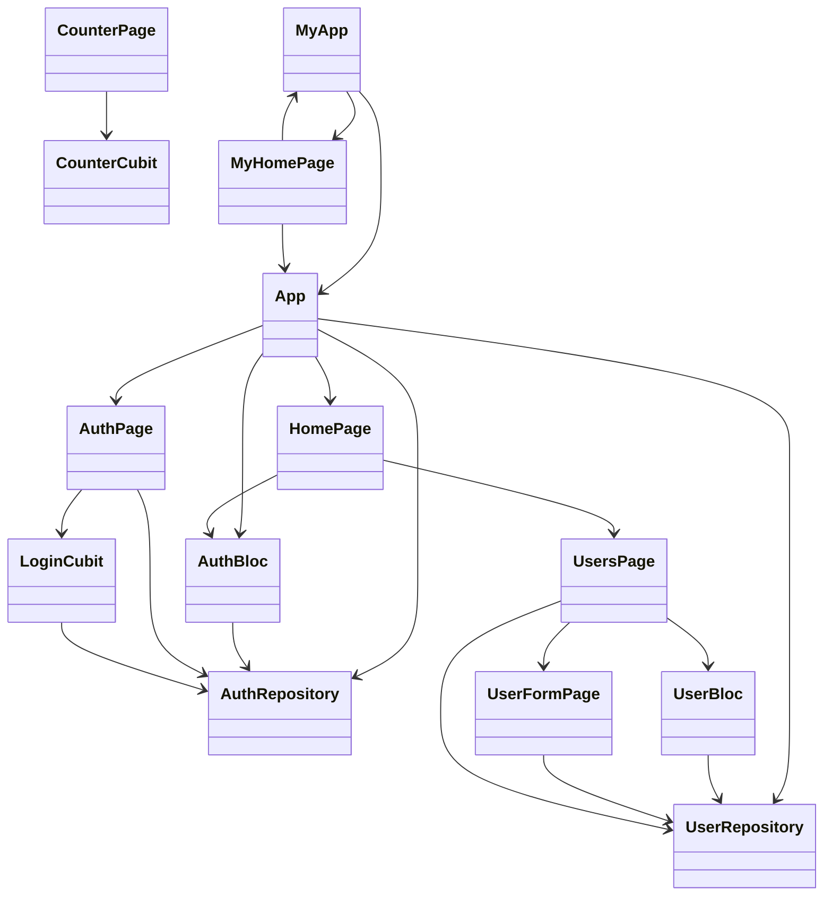

# Architecture Antigravity

This document is automatically generated. It represents the current architecture of the application, focusing on the integration of key components.

```mermaid
classDiagram
  class App
  class AuthBloc
  class AuthPage
  class AuthRepository
  class CounterCubit
  class CounterPage
  class HomePage
  class LoginCubit
  class MyApp
  class MyHomePage
  class UserBloc
  class UserFormPage
  class UserRepository
  class UsersPage
  App --> AuthBloc
  App --> AuthPage
  App --> AuthRepository
  App --> HomePage
  App --> UserRepository
  AuthBloc --> AuthRepository
  AuthPage --> AuthRepository
  AuthPage --> LoginCubit
  CounterPage --> CounterCubit
  HomePage --> AuthBloc
  HomePage --> UsersPage
  LoginCubit --> AuthRepository
  MyApp --> App
  MyApp --> MyHomePage
  MyHomePage --> App
  MyHomePage --> MyApp
  UserBloc --> UserRepository
  UserFormPage --> UserRepository
  UsersPage --> UserBloc
  UsersPage --> UserFormPage
  UsersPage --> UserRepository
```
